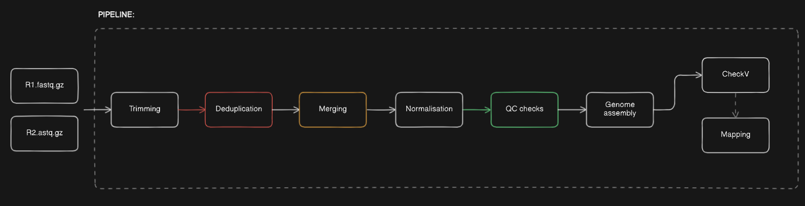

# Phanta
[](https://doi.org/10.5281/zenodo.13981010)

Configurable short read assembly pipeline for phages:

**Figure 1:** Rough phage assembly pipeline, dotted line indicates where processing begins.

## Install dependencies
1. Create the environment
```sh
conda env create --file phanta.yml
```

3. Activate the environment:
```sh
conda activate phanta
```

4. Install phanta pipeline:
```sh
pip install phanta
```

5. Optional: Set up the checkv database 
```sh
checkv download_database /path/to/checkv-db
```

```sh
export CHECKVDB=/path/to/checkv-db
```

## Usage
Open a python terminal and enter:
```py
import phanta
dir(phanta)
```

Detect reads:
This will return a list of Reads class objects that can be passed individually or as a batch to assembly pipelines
```py
import phanta
reads = phanta.detect_reads('path_to_input_directory/')
```

Single phage assembly (Uses the default configurations below if no config parameter is specified):
```py
import phanta
reads = phanta.detect_reads('path_to_input_directory/')
phanta.assembly_pipeline(reads[0], 'output_directory/')
```

Batch phage assembly (Using your own edited config file):
```py
import phanta
phanta.batch_assembly_pipeline('path_to_input_directory/', 'output_directory/', config_file='/path_to_config.json')
```

Reads QC only:
```py
import phanta
phanta.batch_assembly_pipeline('path_to_input_directory/', 'output_directory/', qc_only=True)
```

## Citation:
There is a CITATION file in this repository (.CFF), however Phanta may also be cited like so:
```
Iszatt, Joshua James. (2024). PHANTA short read assembly pipeline (Version v0.3) [Computer software]. Zenodo. https://doi.org/10.5281/zenodo.13981011
```

## Dependencies:
  - python>=3
  - checkv==1.0.3
  - biopython==1.83
  - bbmap==39.06
  - pandas==2.2.1
  - matplotlib==3.8.4
  - spades==3.15.5
  - fastqc==0.12.1
  - multiqc==1.22.1
  - pilon==1.24
  - packaging
  - deprecated

### Configuration
These are the defaults, amend as required and pass to the pipeline functions
```json
{
 "system": {
  "RAM": 24000,
  "threads": 8
 },
 "input": {
  "interleaved_ext": "_interleaved.fastq",
  "r1_ext": "_R1.fastq.gz",
  "r2_ext": "_R2.fastq.gz"
 },
 "reads": {
  "read_length": 150,
  "trim_length": 10,
  "minimum_length": 100,
  "read_quality": 30,
  "error_correction": true,
  "target_coverage": 200
 },
 "assembly": {
  "kmers": "55,77,99,127"
 },
 "extraction": {
  "mincov": 60,
  "minlen": 4000,
  "mincomplete":90
 }
}
```
